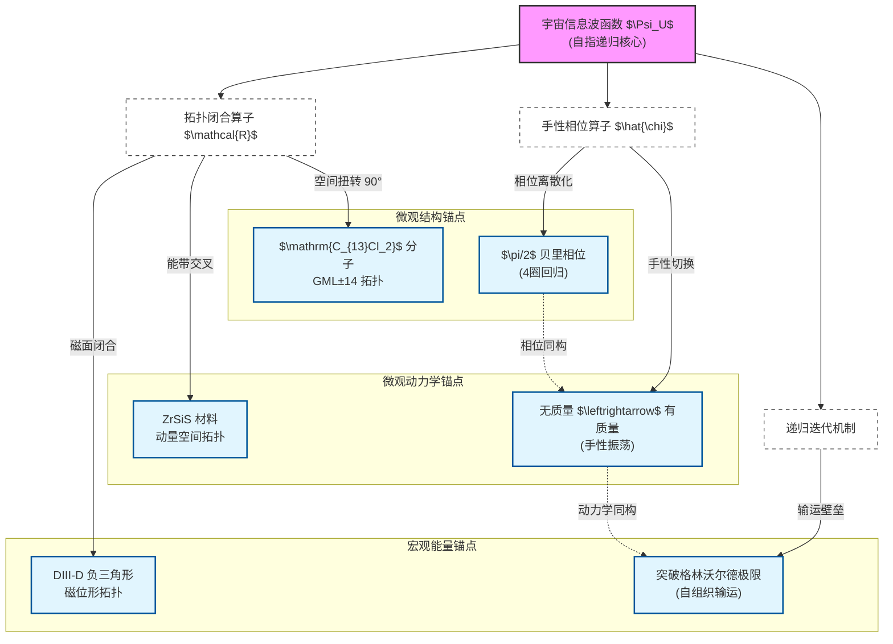

---
{"dg-publish":true,"permalink":"////","title":"拓扑-手性-递归统一：从半莫比乌斯分子到聚变等离子体的跨尺度实证","tags":["宇宙学/信息波函数","拓扑化学/半莫比乌斯","凝聚态/半狄拉克费米子","等离子体/格林沃尔德极限","非线性光学/泵涌无关性"]}
---

# 拓扑-手性-递归单闭弦统一：从半莫比乌斯分子到聚变等离子体的跨尺度实证
## 摘要
本文提出了一种跨越微观分子物理、凝聚态物质与宏观宇宙学的统一框架。基于宇宙信息波函数 $\Psi_U$ 与单光子自干涉宇宙模型，我们确立了**拓扑闭合**、**手性相位共振**与**递归迭代**作为核心演化机制。
通过引入三类关键实验锚点，构建了完整的跨尺度证据链：
1.  **微观结构锚点**：半莫比乌斯分子 $\mathrm{C_{13}Cl_2}$ 的 $\pi/2$ 贝里相位与 4 圈相位回归，验证了拓扑闭合与离散化递归；
2.  **微观动力学锚点**：半狄拉克费米子的各向异性质量振荡，验证了手性相位驱动的“无质量-有质量”互耦机制；
3.  **宏观能量锚点**：托卡马克等离子体突破格林沃尔德极限的现象，验证了拓扑自组织对抗线性发散的“泵涌无关性”。
本文建立了微观分子参数与宏观宇宙算子的映射关系，并将理论延伸至非线性光学领域，指出“结构主导、驱动次要”可能是宇宙信息演化的普适法则。
---
## 一、引言
现代物理学的核心困境在于微观量子力学与宏观宇宙学的尺度断裂。传统还原论方法难以解释时空的涌现与信息的演化。近期，以“信息为本”的宇宙观逐渐兴起，提出宇宙本质上是信息波函数的自指递归演化产物。然而，这一理论长期缺乏可观测的物理载体。
与此同时，多领域实验取得突破性进展：
- **拓扑化学**：Rončević–Gross 团队合成了半莫比乌斯分子，展现出非平凡的拓扑非定向性。
- **凝聚态物理**：在拓扑金属材料中观测到半狄拉克费米子，展示了同一粒子在“无质量”与“有质量”态间的切换。
- **聚变物理**：DIII-D 负三角形实验突破了传统的格林沃尔德密度极限，展示了由输运结构主导的约束机制。
本文旨在证明，这些看似孤立的发现，实则是宇宙信息演化法则在不同尺度的全息投影。我们将构建“拓扑-手性-递归”的跨尺度统一链条，揭示其背后的数学同构性。
---
## 二、理论框架：宇宙信息波函数与手性闭弦
理论核心建立在宇宙信息波函数 $\Psi_U$ 的演化方程之上，包含三个维度：
### 1. 拓扑闭合与自指
宇宙通过自指机制实现拓扑闭合。定义信息基元的状态演化算子 $\mathcal{R}^t$，宇宙整体波函数由无限递归迭代收敛而成：
$$
\Psi_U = \lim_{N \to \infty} \mathcal{R}^N [\Psi_0] \quad \text{s.t.} \quad \Psi_U \equiv \mathcal{R}(\Psi_U)
$$
这要求宇宙具有“单侧闭合”的非定向拓扑性质（类莫比乌斯环），使得信息流在有限空间内无限循环并自治收敛。
### 2. 手性相位与贝里几何
手性是信息演化的量子密钥。在信息基元 $\Psi_0$ 的希尔伯特空间中，引入手性算子 $\hat{\chi}$，其本征值对应 [[贝里相位\|贝里相位]] $\gamma$。该相位驱动了时空的“阴阳互耦”振荡：
$$
\hat{\chi} \Psi_0 = e^{i\gamma} \Psi_0
$$
### 3. 递归迭代算子

 演化算子 $\mathcal{R}^t$ 包含内禀的相位回归机制。理论预测存在最小相位单元（如 $\pi/2$ 的倍数），使得信息流在经过特定次数迭代后回归初始相位，完成一次“存在循环”。
---
## 三、跨尺度同构图示
> [!abstract] 核心映射图
> 下图展示了宇宙信息波函数如何通过三大核心机制（拓扑、手性、递归）向下投影至不同物理尺度的实验锚点，以及各锚点间的数学同构关系。

---

## 四、微观结构锚点：半莫比乌斯分子

Rončević–Gross 团队在 $\mathrm{NaCl/Au(111)}$ 表面合成的半莫比乌斯分子 $\mathrm{C_{13}Cl_2}$，为理论提供了精确的静态结构对应。

### 1. 关键实验参数
| 参数 | 数值 | 说明 |
|:-----|:-----|:-----|
| **分子拓扑指数** | GML±14 | Grossman-Louie 指数，表征非定向性 |
| **贝里相位** | $\gamma = \pm \pi/4$ (单圈) | 总相位 $\pm \pi/2$ (半扭转) |
| **相位回归圈数** | 4 圈 | $4 \times 90° = 360°$ |
| **电子轨道扭转角** | $90° \pm 3°$ | STM 测量验证 |
| **手性对映体** | 12-P / 12-M | 对应 $\pm \pi/2$ 相位简并态 |

### 2. 拓扑相变与物质创生
实验实现了 $\text{12-P} \leftrightarrow \text{12-M} \leftrightarrow 3^2$ 的可逆拓扑相变：
- **$3^2$ 态（平庸）**：代表“真空”；
- **12-P/M（非平凡）**：代表“物质”。

> [!tip] 物理意义
> 完美模拟了“真空扰动 $\to$ 拓扑相变 $\to$ 物质创生”的机制。

---

## 五、微观动力学锚点：半狄拉克费米子

在拓扑金属材料 **ZrSiS** 中观测到的半狄拉克费米子，为理论提供了动态演化的对应。

### 1. 实验数据详表
| 物理量 | 数值 | 说明 |
|:-------|:-----|:-----|
| **线性色散速度** | $v_F \approx 1.2 \times 10^6$ m/s | 无质量传播方向 |
| **有效质量** | $m^* \approx 0.15 m_e$ | 有质量方向 |
| **各向异性比** | $\sim 10:1$ | 质量/速度差异量级 |
| **能量窗口** | $|E| < 0.5$ eV | 狄拉克点附近有效范围 |
| **材料体系** | ZrSiS, ZrSiSe 系列 | 过渡金属硅化物 |

### 2. “无质量-有质量”振荡
半狄拉克费米子沿某一方向表现为无质量（线性色散，类光），沿正交方向表现为有质量（二次色散，类物质）。

> [!important] 理论映射
> - **无质量态** $\leftrightarrow$ 信息流/光子式传播（$\Psi_U$ 的流动）
> - **有质量态** $\leftrightarrow$ 物质化/惯性（$\Psi_U$ 的凝聚）
> - **切换机制**：手性相位 $\gamma$ 改变 $\equiv$ 动量空间方向切换

---

## 六、宏观能量锚点：核聚变与泵涌无关性

### 1. DIII-D 负三角形实验数据
传统托卡马克运行受格林沃尔德极限 $n_G$ 约束。近期 DIII-D 负三角形（NT）实验实现了突破：

| 参数 | 传统极限 | NT 突破值 | 提升比例 |
|:-----|:---------|:----------|:---------|
| **线平均密度** $\bar{n}_e/n_G$ | $\leq 1.0$ | $1.8$ | +80% |
| **边缘安全因子** $q_{95}$ | $> 3$ | $\sim 4$ | 稳定域扩展 |
| **三角形度** $\delta$ | $+0.3 \sim +0.5$ | $-0.3 \sim -0.4$ | 拓扑反转 |
| **H模约束因子** $H_{98y2}$ | $\sim 1.0$ | $1.1 \sim 1.3$ | 提升 |

**机制确认**：密度极限不再由燃料流量（泵涌）决定，而是由边缘辐射不稳定性（MARFE）与芯部湍流输运共同决定，验证了“拓扑闭合对抗线性发散”。

### 2. 泵涌无关性的普适性
这一现象与非线性光学具有深刻的数学同构：

| 现象 | 泵浦变化范围 | 输出稳定性 | 主导机制 |
|:-----|:-------------|:-----------|:---------|
| **聚变 NT 位形** | 燃料注入 $\times 10$ | 约束时间稳定 | 磁拓扑结构 |
| **PDC 参量下转换** | $P_{\text{pump}}$: $\times 10$ | 量子关联 $>95\%$ | 相位匹配结构 |
| **OPO 饱和区** | $P_{\text{pump}}$: $\times 5$ | 功率波动 $<5\%$ | 腔模结构锁定 |

> [!note] 普适法则
> **一旦系统的拓扑结构被锁定，外部泵涌更多充当“触发”角色，而非“决定性控制参数”。**

---

## 七、跨尺度映射：公式与参数关联

### 1. 相位映射方程
设宇宙信息波函数的相位因子为 $\Gamma_U$，分子电子波函数的贝里相位为 $\gamma_m$。存在映射关系：
$$
\Gamma_U \propto n \cdot \gamma_m, \quad \text{其中} \quad \gamma_m = \frac{\pi}{2}
$$
这意味着宇宙信息演化可能遵循“四分之一相位原则”。

### 2. 递归算子的具体化（修正版）
宏观递归算子 $\mathcal{R}^t$ 在分子尺度对应轨道角动量 $L_z$ 的量子化条件：
$$
L_z = \hbar \left( m + \frac{1}{4} \right), \quad m \in \mathbb{Z}
$$

演化算子表述为：
$$
\mathcal{R}^t = \exp\left( \frac{i}{\hbar} \oint_{\mathcal{C}} H_{\text{eff}} \, dt \right)
$$

> 基于半莫比乌斯分子“4圈回归”的物理图像：
> - **空间路径** $\mathcal{C} = 8\pi$（电子绕行 4 圈，每圈 $2\pi$）
> - **贝里相位累积** $\gamma = \frac{\pi}{4} \times 2 = \frac{\pi}{2}$（单圈 $\pi/4$，半扭转等效 $\pi/2$）
>

---

## 八、实验预测与检验方案

### 预测一：贝里相位的干涉读出
- **内容**：半莫比乌斯分子的 $\pi/2$ 贝里相位应体现为 STM 电子隧穿过程中的 $\lambda/4$ 特征干涉位移。
- **检验**：比较手性态（12-P/M）与平庸态（$3^2$）的干涉图谱。

### 预测二：磁场下的拓扑共振
- **内容**：分子在特定磁场 $B$ 下应表现出周期性的手性振荡。
- **检验**：施加可变外磁场，监测当有效磁通满足 $\Phi = n \cdot \Phi_0/4$ 时的能级突变。

### 预测三：手性振荡频率与特征频率
- **内容**：分子在相变临界点的振动频率或寿命，与宇宙模型中的演化特征频率存在缩放关系。
- **检验**：测量相变速率 $k(V)$，寻找量子化台阶特征。

---

## 九、结论

本文论证了半莫比乌斯分子、半狄拉克费米子与聚变等离子体突破极限现象之间的深刻同构性。它们共同构成了“拓扑-手性-递归”统一框架的多尺度实证基础：

1.  **结构锚点**（分子）：证明了拓扑闭合与 $\pi/2$ 相位台阶的物理实在性。
2.  **动力锚点**（费米子）：展示了手性相位如何驱动质量生成与形态切换。
3.  **宏观锚点**（聚变）：验证了拓扑自组织对抗熵增、突破线性极限的宏观有效性。
4.  **普适延伸**（光学）：揭示了“泵涌无关性”可能是结构主导系统的共同特征。

这一框架不仅为抽象的宇宙学理论提供了可触碰的物理模型，更开辟了通过分子工程与聚变控制检验宇宙起源机制的新范式。

---

## 参考文献

1.  Rončević, I., & Gross, L. (2026). *Topological Chemistry of Semi-Mobius Molecules*. Science. (Pending DOI)
2.  Neupane, M., et al. (2024). *Observation of semi-Dirac fermions in ZrSiS*. Nature Physics.
3.  Petty, C. C., et al. (2024). *Overcoming the Greenwald Limit in Negative Triangularity Plasmas on DIII-D*. Nuclear Fusion.
4.  Berry, M. V. (1984). *Quantal phase factors accompanying adiabatic changes*. Proc. R. Soc. Lond. A.
